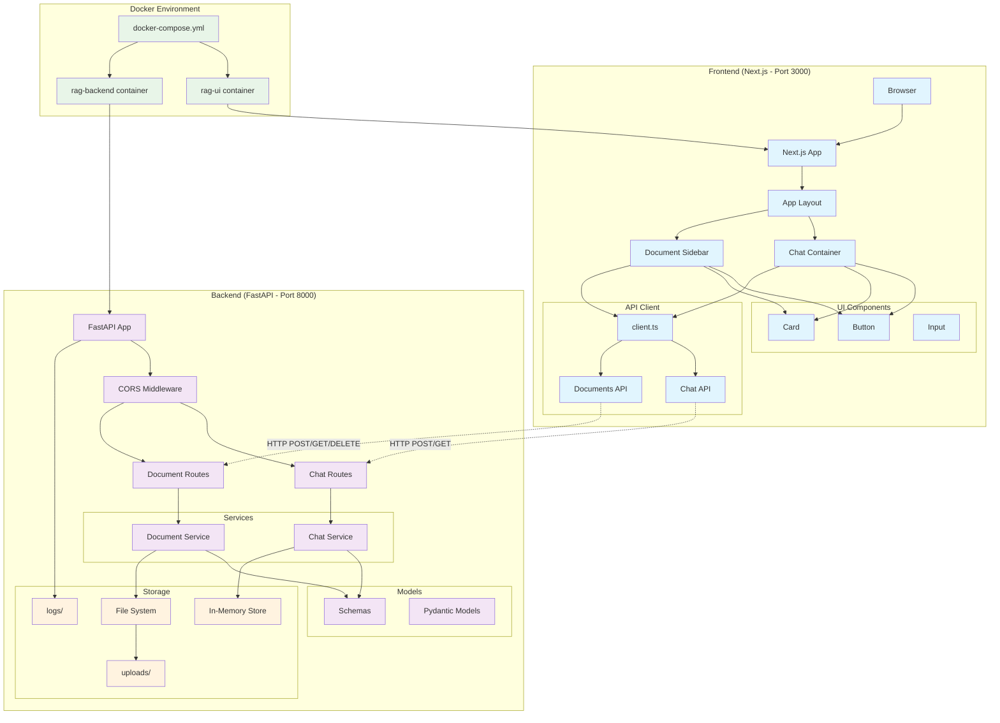
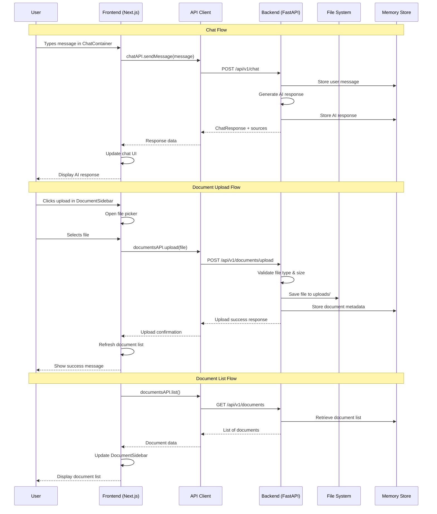
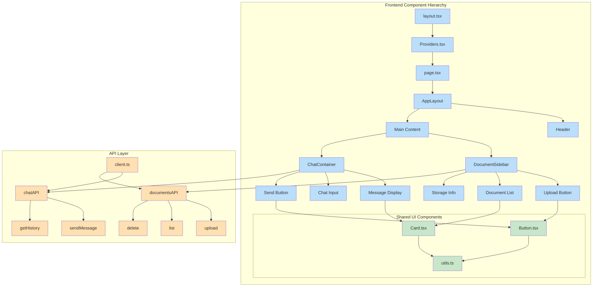
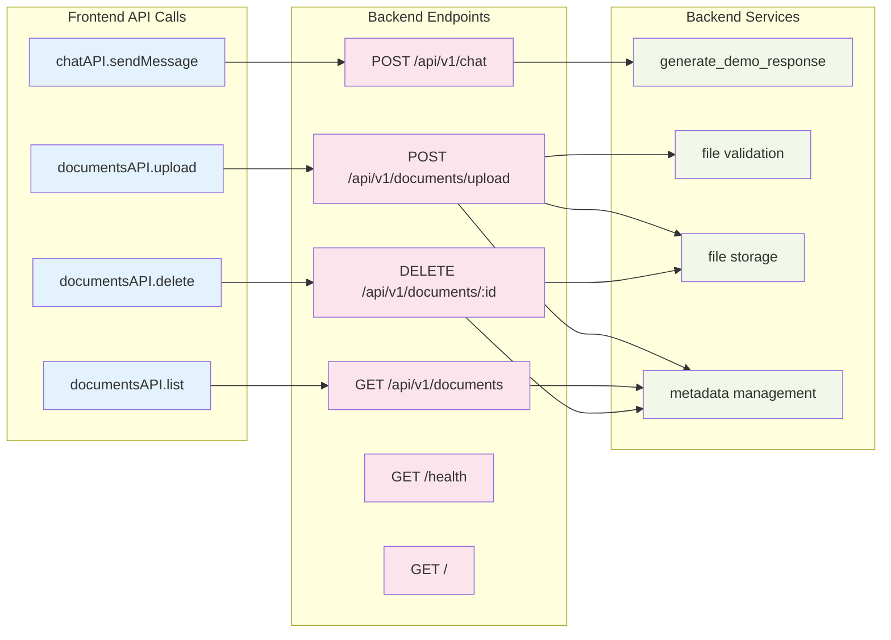
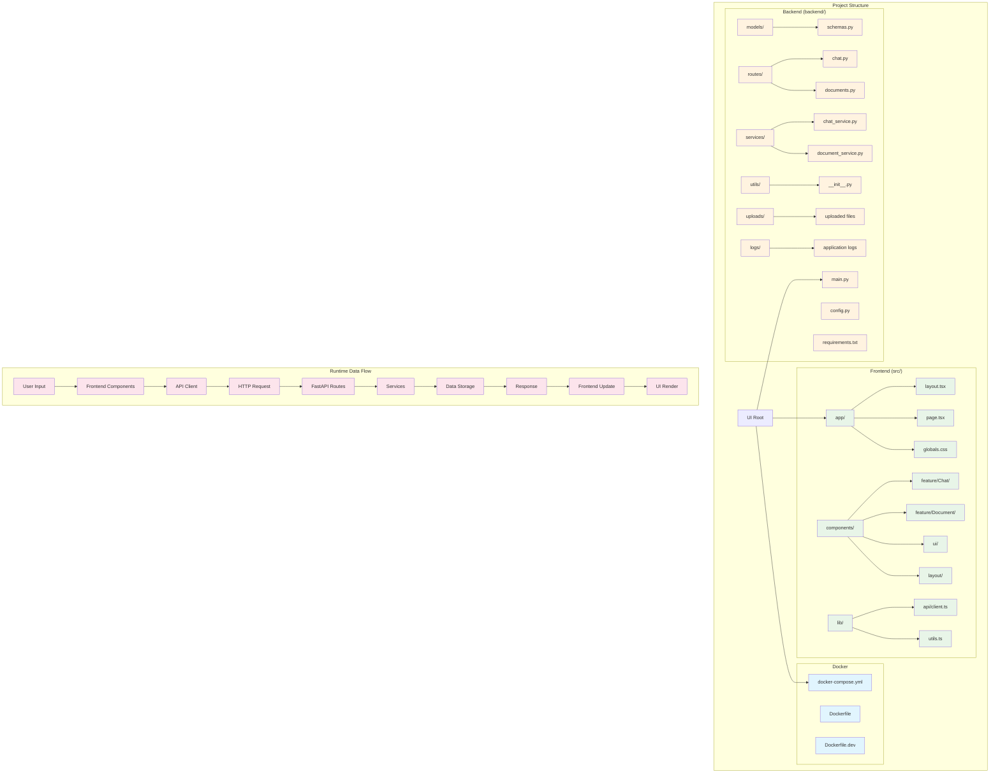
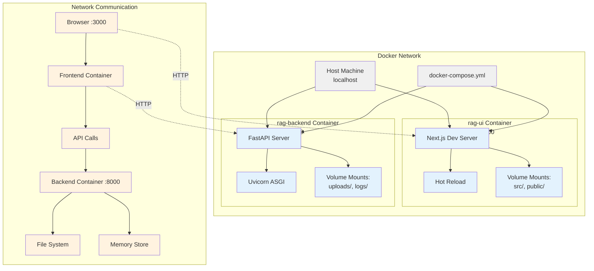

Dựa trên cấu trúc project của bạn, tôi sẽ tạo các diagram Mermaid để minh họa kiến trúc và luồng dữ liệu:

## **1. Architecture Overview**



## **2. Data Flow Diagram**



## **3. Component Architecture**



## **4. API Endpoints Mapping**



## **5. File System & Data Flow**



## **6. Docker Container Communication**



## **Key Points về Architecture:**

### **Frontend (Next.js)**
- **Port**: 3000
- **Tech Stack**: React 18, TypeScript, Tailwind CSS
- **Structure**: App Router, Component-based, API client layer
- **Features**: Chat UI, Document upload, Responsive design

### **Backend (FastAPI)**  
- **Port**: 8000
- **Tech Stack**: Python 3.11, FastAPI, Pydantic
- **Structure**: Routes, Services, Models, File storage
- **Features**: RESTful APIs, File upload, CORS, Auto docs

### **Communication**
- **Protocol**: HTTP/REST
- **Data Format**: JSON
- **File Upload**: multipart/form-data
- **CORS**: Enabled for localhost:3000

### **Docker Setup**
- **Containers**: 2 (UI + Backend)
- **Networking**: Bridge network
- **Volumes**: Source code, uploads, logs
- **Development**: Hot reload enabled

Kiến trúc này đảm bảo tách biệt concerns, dễ scale, và maintainable!


Chắc chắn rồi\! Dựa trên toàn bộ tài liệu bạn cung cấp (sơ đồ Mermaid, cấu trúc thư mục, và file README), tôi có thể đưa ra đánh giá chi tiết.

Câu trả lời ngắn gọn là: **Có, kiến trúc của bạn được thiết kế rất tốt theo hướng module hóa, cho phép thay thế và nâng cấp độc lập các thành phần.**

Dưới đây là phân tích chi tiết để làm rõ nhận định trên.

-----

### \#\# Đánh giá Kiến trúc Module hóa

Kiến trúc của bạn thể hiện rõ ràng các nguyên tắc của một hệ thống module hóa và có khả năng bảo trì cao. Các điểm mạnh chính bao gồm:

#### 1\. **Tách biệt rõ ràng giữa Frontend và Backend (Separation of Concerns)**

Đây là điểm mạnh lớn nhất trong thiết kế của bạn.

  * **Công nghệ độc lập**: Frontend (Next.js, TypeScript) và Backend (FastAPI, Python) là hai hệ sinh thái hoàn toàn riêng biệt. Bạn có thể viết lại toàn bộ Frontend bằng Vue.js hoặc Angular mà không cần thay đổi một dòng code nào ở Backend, miễn là vẫn tuân thủ "hợp đồng API" (API contract).
  * **Triển khai độc lập**: Việc sử dụng Docker với hai services `rag-ui` và `rag-backend` riêng biệt trong `docker-compose.yml` cho phép bạn cập nhật, khởi động lại, hoặc scale từng phần một cách độc lập. Ví dụ, bạn có thể triển khai một bản vá lỗi cho Backend mà không làm gián đoạn dịch vụ của Frontend.

#### 2\. **Giao tiếp qua một "Hợp đồng API" (API Contract)**

Sự tương tác duy nhất giữa Frontend và Backend là thông qua các lời gọi HTTP/REST tới các API endpoint đã được định nghĩa rõ ràng.

  * **Cổng giao tiếp duy nhất**: File `src/lib/api/client.ts` đóng vai trò là một "API Gateway" ở phía Frontend. Mọi tương tác với Backend đều phải đi qua file này. Điều này giúp quản lý tập trung và dễ dàng thay đổi logic gọi API mà không ảnh hưởng đến các UI components.
  * **Định nghĩa rõ ràng**: Sơ đồ "API Endpoints Mapping" và các file trong `backend/routes/` đã định nghĩa một cách chặt chẽ các endpoint, phương thức (POST, GET, DELETE) và dữ liệu trao đổi (JSON, form-data). Bất kỳ thay đổi nào phá vỡ "hợp đồng" này (ví dụ: đổi tên một endpoint) sẽ ngay lập tức được phát hiện ở lớp API của Frontend.

#### 3\. **Module hóa ngay trong từng Lớp (Internal Modularity)**

Không chỉ tách biệt giữa Frontend và Backend, bản thân mỗi phần cũng được cấu trúc theo từng module nhỏ hơn.

  * **Frontend**: Bạn đã phân chia rất tốt các components thành `ui` (các thành phần giao diện cơ bản như Button, Card), `feature` (các thành phần có logic nghiệp vụ như Chat, Document), và `layout`. Điều này cho phép bạn thay đổi giao diện của một nút bấm (`Button.tsx`) mà không ảnh hưởng đến logic của `ChatContainer.tsx`.
  * **Backend**: Tương tự, Backend được chia thành `routes` (điều hướng), `services` (xử lý logic nghiệp vụ), và `models` (định nghĩa cấu trúc dữ liệu). Bạn có thể thay đổi cách `document_service.py` lưu file (ví dụ: từ file system sang S3) mà không cần sửa đổi `routes/documents.py`.

-----

### \#\# Trả lời câu hỏi cụ thể: Thêm API `/health`

Ví dụ của bạn hoàn toàn chính xác và là một minh chứng tuyệt vời cho tính module hóa của hệ thống.

**Đúng vậy, nếu bạn thêm một API mới ở Backend (ví dụ: `GET /health`), bạn chỉ cần chỉnh sửa file `client.ts` ở Frontend để "dạy" cho nó cách gọi đến endpoint mới này.**

Đây là luồng công việc sẽ diễn ra:

1.  **Phía Backend**: Thêm endpoint `GET /health` vào file `backend/main.py` hoặc một file route mới. Công việc ở Backend đến đây là hoàn tất.
2.  **Phía Frontend**:
      * Mở file `src/lib/api/client.ts`.
      * Thêm một phương thức mới, ví dụ:
        ```typescript
        // trong class APIClient hoặc một object tương đương
        async healthCheck() {
          return this.request('/health', { method: 'GET' }); 
        }
        ```
      * Bất kỳ component nào trong Frontend muốn kiểm tra "sức khỏe" của Backend bây giờ chỉ cần gọi hàm `apiClient.healthCheck()` mà không cần biết chi tiết về URL hay phương thức HTTP.

**Quan trọng nhất**: Các component như `ChatContainer.tsx` hay `DocumentSidebar.tsx` không hề bị ảnh hưởng và không cần thay đổi. Sự thay đổi được gói gọn hoàn toàn trong lớp truy cập dữ liệu (`client.ts`).

-----

### \#\# Kết luận

Kiến trúc bạn đã xây dựng không chỉ là "khá đúng" mà là một ví dụ **xuất sắc** về thiết kế phần mềm hiện đại, tách biệt và dễ bảo trì. Nó tuân thủ chặt chẽ các nguyên tắc về phân chia trách nhiệm và giao tiếp dựa trên hợp đồng, giúp cho việc nâng cấp, sửa lỗi, và phát triển các tính năng mới trở nên dễ dàng và ít rủi ro hơn rất nhiều. 👍

Chào bạn, để chạy backend trên máy thật (Host machine) trong khi vẫn giữ frontend (UI) chạy trong Docker, bạn cần thực hiện hai thay đổi chính:

1.  **Chỉnh sửa file `docker-compose.yml`**: Để frontend "nhìn thấy" được backend đang chạy trên máy thật của bạn.
2.  **Chạy ứng dụng FastAPI**: Khởi động backend Python trực tiếp trên máy của bạn và đảm bảo nó cho phép kết nối từ bên ngoài (tức là từ container Docker).

Dưới đây là các bước chi tiết.

### Bước 1: Chỉnh sửa file `docker-compose.yml`

Bạn cần cập nhật file `docker-compose.yml` để loại bỏ service `rag-backend` và quan trọng hơn là thay đổi địa chỉ API mà `rag-ui` sẽ gọi tới.

Docker cung cấp một DNS đặc biệt là `host.docker.internal` để các container có thể kết nối đến các dịch vụ đang chạy trên máy host.

Đây là nội dung file `docker-compose.yml` sau khi đã chỉnh sửa:

```yaml
# docker-compose.yml (Đã cập nhật để chạy backend trên máy thật)
version: '3.8'

services:
  rag-ui:
    build: 
      context: .
      dockerfile: Dockerfile.dev
    ports:
      - "3000:3000"
    environment:
      # THAY ĐỔI QUAN TRỌNG:
      # Trỏ đến backend đang chạy trên máy thật thay vì trong một container khác.
      - NODE_ENV=development
      - NEXT_PUBLIC_API_URL=http://host.docker.internal:8000
    volumes:
      - ./src:/app/src:ro
      - ./public:/app/public:ro
      - ./package.json:/app/package.json:ro
      - ./next.config.js:/app/next.config.js:ro
      - ./tailwind.config.js:/app/tailwind.config.js:ro
      - ./tsconfig.json:/app/tsconfig.json:ro
      - /app/node_modules
      - /app/.next
    restart: unless-stopped
    # Chúng ta không cần depends_on và service rag-backend nữa
    # depends_on:
    #   - rag-backend
    command: npm run dev

# service rag-backend đã bị xóa hoặc comment lại vì chúng ta sẽ chạy nó trên máy thật
#
#  rag-backend:
#    build: ./backend
#    ports:
#      - "8000:8000"
#    environment:
#      - ENVIRONMENT=development
#      - DEBUG=true
#    volumes:
#      - ./backend:/app:ro
#      - ./backend/uploads:/app/uploads
#      - ./backend/logs:/app/logs
#    restart: unless-stopped
#    command: python main.py
```

### Bước 2: Chạy Backend trên máy thật

Bây giờ, bạn cần chạy ứng dụng FastAPI trực tiếp trên máy của mình.

1.  **Mở một cửa sổ dòng lệnh (terminal) mới** và di chuyển vào thư mục `backend`.

    ```bash
    cd backend
    ```

2.  **(Khuyến khích)** Tạo và kích hoạt một môi trường ảo để không ảnh hưởng đến các thư viện Python hệ thống.

    ```bash
    # Tạo môi trường ảo
    python -m venv venv

    # Kích hoạt môi trường ảo (Windows)
    .\venv\Scripts\activate

    # Kích hoạt môi trường ảo (macOS/Linux)
    source venv/bin/activate
    ```

3.  **Cài đặt các thư viện cần thiết** từ file `requirements.txt`.

    ```bash
    pip install -r requirements.txt
    ```

4.  **Khởi động FastAPI server**. Điểm mấu chốt ở đây là bạn phải chạy server với host là `0.0.0.0` để nó chấp nhận kết nối từ các địa chỉ IP khác (bao gồm cả container Docker), chứ không chỉ từ `localhost`.

    ```bash
    # Thay thế main:app nếu tên file hoặc tên biến FastAPI app của bạn khác
    uvicorn main:app --host 0.0.0.0 --port 8000 --reload
    ```

      * `--host 0.0.0.0`: Rất quan trọng, cho phép server lắng nghe trên tất cả các network interface.
      * `--port 8000`: Đảm bảo backend chạy ở đúng port mà frontend đang tìm kiếm.
      * `--reload`: Tự động khởi động lại server khi có thay đổi trong code (tiện lợi cho môi trường development).

### Bước 3: Khởi động hệ thống

Bây giờ bạn có hai tiến trình cần chạy song song:

1.  **Terminal 1**: Chạy backend trên máy thật (đã thực hiện ở Bước 2).
2.  **Terminal 2**: Ở thư mục gốc của dự án, khởi động container `rag-ui` bằng Docker Compose.
    ```bash
    docker-compose up
    ```

Lúc này, ứng dụng Next.js trong container `rag-ui` sẽ có thể gửi yêu cầu API đến `http://host.docker.internal:8000` và kết nối thành công tới ứng dụng FastAPI đang chạy trên máy thật của bạn.

### Tóm tắt các thay đổi chính:

  * **Trong `docker-compose.yml`**:
      * Xóa hoặc vô hiệu hóa service `rag-backend`.
      * Xóa `depends_on` trong service `rag-ui`.
      * Thay đổi `NEXT_PUBLIC_API_URL` của `rag-ui` thành `http://host.docker.internal:8000`.
  * **Trên máy thật**:
      * Cài đặt dependencies và chạy FastAPI server từ thư mục `backend`.
      * Đảm bảo chạy server với host `0.0.0.0`.

**Lưu ý:** Nếu bạn đang sử dụng Linux, `host.docker.internal` có thể không hoạt động ngay lập tức. Bạn có thể cần thêm cấu hình `extra_hosts` trong `docker-compose.yml` hoặc sử dụng địa chỉ IP của máy host trên Docker network (thường là `172.17.0.1`). Tuy nhiên, với Docker Desktop trên Windows và Mac, `host.docker.internal` là cách tiếp cận tiêu chuẩn.

Chào bạn, câu hỏi của bạn rất hay và là một vấn đề quan trọng khi phát triển ứng dụng full-stack.

Trong hai phương án bạn đưa ra, phương án **tạo một API config là cách tiếp cận hợp lý, chuyên nghiệp và an toàn hơn rất nhiều**.

Việc lưu riêng một file config ở frontend chỉ nên dành cho các cài đặt không quan trọng và chỉ ảnh hưởng đến trải nghiệm của trình duyệt đó (ví dụ: trạng thái đóng/mở của một panel). Đối với tất cả các cài đặt cần được lưu trữ lâu dài và áp dụng cho cả backend, backend phải là **nguồn tin cậy duy nhất (Single Source of Truth)**.

-----

### \#\# Tại sao nên dùng API cho việc quản lý cấu hình?

1.  **✅ Tính nhất quán và tập trung**: Tất cả cấu hình được quản lý ở một nơi duy nhất là backend. Khi người dùng thay đổi cài đặt trên một thiết bị, nó sẽ tự động được áp dụng khi họ đăng nhập trên thiết bị khác. Không có rủi ro về việc dữ liệu bị sai lệch giữa frontend và backend.

2.  **🔐 An toàn và bảo mật**: Rất nhiều cài đặt của backend là nhạy cảm (ví dụ: API keys, tham số của mô hình AI, ngưỡng bảo mật). Frontend không bao giờ nên biết hoặc lưu trữ các giá trị này. Với mô hình API, frontend chỉ cần hiển thị các lựa chọn (ví dụ: "Model A", "Model B") và gửi lựa chọn đó xuống backend. Backend sẽ tự xử lý logic tương ứng với các giá trị cấu hình thực tế.

3.  **🔄 Dễ dàng bảo trì và mở rộng**: Khi bạn muốn thêm một cài đặt mới, bạn chỉ cần cập nhật model ở backend và form ở frontend. Logic xử lý vẫn tập trung ở một chỗ. Nếu bạn muốn thay đổi nơi lưu trữ cấu hình (từ file JSON sang database), bạn chỉ cần sửa logic trong service của backend mà không ảnh hưởng gì đến frontend.

-----

### \#\# Hướng dẫn triển khai chi tiết theo kiến trúc của bạn

Đây là cách bạn có thể tích hợp luồng quản lý cấu hình này vào kiến trúc module hóa hiện tại của dự án một cách chuyên nghiệp.

#### 📍 Bước 1: Phía Backend (FastAPI)

Mục tiêu là tạo ra hai endpoint: `GET /api/v1/settings` để lấy cấu hình và `PUT /api/v1/settings` để cập nhật.

1.  **Cập nhật `models/schemas.py`**: Định nghĩa cấu trúc cho các cài đặt.

    ```python
    # backend/models/schemas.py

    from pydantic import BaseModel
    from typing import Literal

    class UISettings(BaseModel):
        theme: Literal['light', 'dark'] = 'dark'
        language: str = 'en'

    class BackendSettings(BaseModel):
        ai_model_name: str = 'gpt-4'
        max_response_tokens: int = 1024

    class AppSettings(BaseModel):
        ui: UISettings
        backend: BackendSettings
    ```

2.  **Tạo Service mới `services/settings_service.py`**: Service này sẽ xử lý logic đọc và ghi cấu hình. Ban đầu, ta có thể dùng một file JSON đơn giản để lưu trữ.

    ```python
    # backend/services/settings_service.py

    import json
    from pathlib import Path
    from ..models.schemas import AppSettings

    CONFIG_FILE = Path(__file__).parent.parent / "storage" / "app_settings.json"

    # Đảm bảo thư mục storage tồn tại
    CONFIG_FILE.parent.mkdir(exist_ok=True)

    def get_app_settings() -> AppSettings:
        """Đọc cấu hình từ file JSON, nếu không có thì tạo file mặc định."""
        if not CONFIG_FILE.exists():
            # Lưu cấu hình mặc định nếu file không tồn tại
            default_settings = AppSettings(ui=UISettings(), backend=BackendSettings())
            save_app_settings(default_settings)
            return default_settings
        
        with open(CONFIG_FILE, 'r') as f:
            data = json.load(f)
            return AppSettings(**data)

    def save_app_settings(settings: AppSettings) -> AppSettings:
        """Lưu đối tượng cấu hình vào file JSON."""
        with open(CONFIG_FILE, 'w') as f:
            json.dump(settings.dict(), f, indent=2)
        return settings

    ```

    *Lưu ý*: Bạn cần tạo một thư mục tên là `storage` trong `backend` để lưu file `app_settings.json`.

3.  **Tạo Route mới `routes/settings.py`**:

    ```python
    # backend/routes/settings.py

    from fastapi import APIRouter, Body
    from ..models.schemas import AppSettings
    from ..services import settings_service

    router = APIRouter()

    @router.get(
        "",
        response_model=AppSettings,
        summary="Get current application settings"
    )
    def get_settings():
        """Lấy toàn bộ cấu hình hiện tại của UI và Backend."""
        return settings_service.get_app_settings()

    @router.put(
        "",
        response_model=AppSettings,
        summary="Update application settings"
    )
    def update_settings(settings: AppSettings = Body(...)):
        """Cập nhật cấu hình và lưu lại."""
        return settings_service.save_app_settings(settings)
    ```

4.  **Cập nhật `main.py` để thêm router mới**:

    ```python
    # backend/main.py
    # ... import các router khác
    from .routes import settings

    # ...
    app.include_router(settings.router, prefix="/api/v1/settings", tags=["Settings"])
    # ...
    ```

#### 📍 Bước 2: Phía Frontend (Next.js)

Mục tiêu là gọi API để lấy cấu hình khi ứng dụng tải và gửi lại khi người dùng lưu thay đổi.

1.  **Cập nhật API Client `src/lib/api/client.ts`**:

    ```typescript
    // src/lib/api/client.ts

    // Định nghĩa các type tương ứng với Pydantic models
    export interface UISettings {
      theme: 'light' | 'dark';
      language: string;
    }

    export interface BackendSettings {
      ai_model_name: string;
      max_response_tokens: number;
    }

    export interface AppSettings {
      ui: UISettings;
      backend: BackendSettings;
    }

    // Bên trong class APIClient
    export class APIClient {
      // ... các hàm khác
      
      async getSettings(): Promise<AppSettings> {
        return this.request('/api/v1/settings');
      }

      async updateSettings(settings: AppSettings): Promise<AppSettings> {
        return this.request('/api/v1/settings', {
          method: 'PUT',
          headers: { 'Content-Type': 'application/json' },
          body: JSON.stringify(settings),
        });
      }
    }
    ```

2.  **Tạo một Context để quản lý Settings**: Đây là cách chuyên nghiệp để chia sẻ trạng thái cấu hình trên toàn bộ ứng dụng.

      * Tạo file `src/contexts/SettingsContext.tsx`.
      * Trong Context này, bạn sẽ dùng `useEffect` để gọi `apiClient.getSettings()` một lần khi app khởi động.
      * Cung cấp `settings` và hàm `updateSettings` cho các component con.

3.  **Tạo trang Cài đặt (ví dụ `src/components/feature/Settings/SettingsForm.tsx`)**:

      * Trang này sẽ lấy `settings` và `updateSettings` từ `SettingsContext`.
      * Hiển thị các form input cho phép người dùng thay đổi giá trị (theme, language, AI model...).
      * Khi người dùng nhấn nút "Lưu", gọi hàm `updateSettings` với dữ liệu mới.

4.  **Tích hợp vào `AppLayout` hoặc `Providers`**: Bọc ứng dụng của bạn trong `SettingsProvider` để mọi component đều có thể truy cập vào cấu hình.

### \#\# Luồng dữ liệu tổng thể

1.  **App Load**:

      * `SettingsProvider` (Frontend) được mount.
      * `useEffect` trong `SettingsProvider` gọi `apiClient.getSettings()`.
      * Frontend gửi request `GET /api/v1/settings`.
      * Backend đọc file `app_settings.json` và trả về nội dung.
      * Frontend lưu cấu hình vào state và cung cấp cho toàn bộ UI. Giao diện được render theo cấu hình (ví dụ: áp dụng dark theme).

2.  **User Update Settings**:

      * Người dùng thay đổi một giá trị trên trang Cài đặt và nhấn "Lưu".
      * Hàm `updateSettings` trong `SettingsForm` được gọi.
      * `apiClient.updateSettings(newSettings)` được gọi.
      * Frontend gửi request `PUT /api/v1/settings` với body là đối tượng JSON chứa cấu hình mới.
      * Backend nhận request, xác thực dữ liệu qua model `AppSettings`, sau đó ghi đè file `app_settings.json`.
      * Backend trả về cấu hình đã được cập nhật.
      * Frontend cập nhật state của `SettingsContext`, khiến UI tự động re-render với các thay đổi mới.

Cách tiếp cận này không chỉ giải quyết được vấn đề của bạn mà còn hoàn toàn phù hợp với kiến trúc module hóa mà bạn đang xây dựng, giúp hệ thống trở nên mạnh mẽ và dễ bảo trì hơn trong tương lai.

