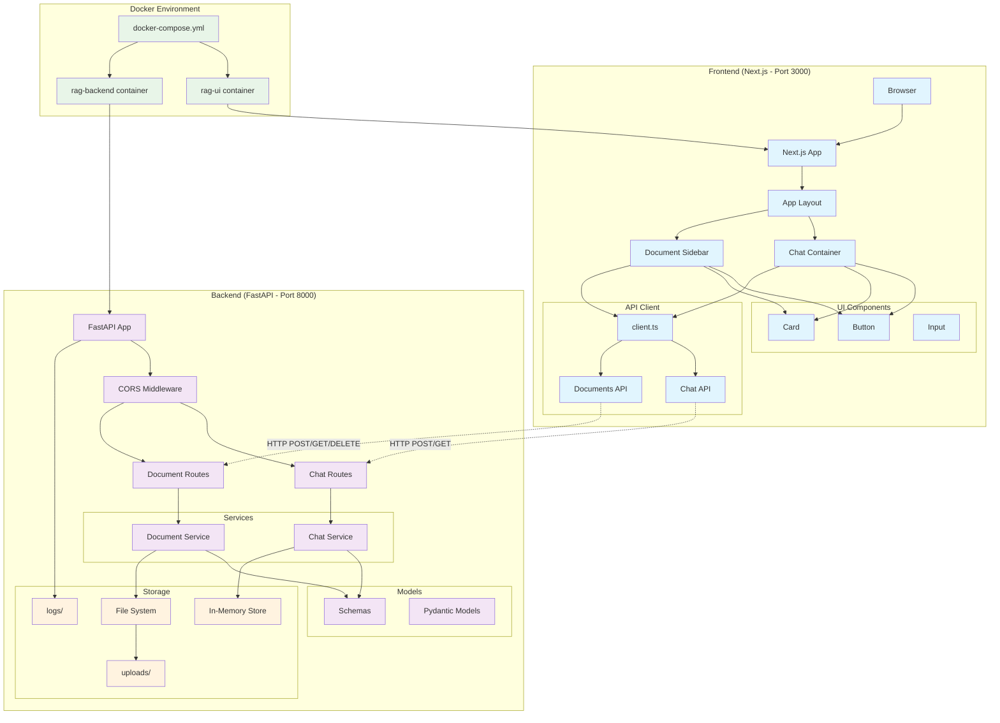
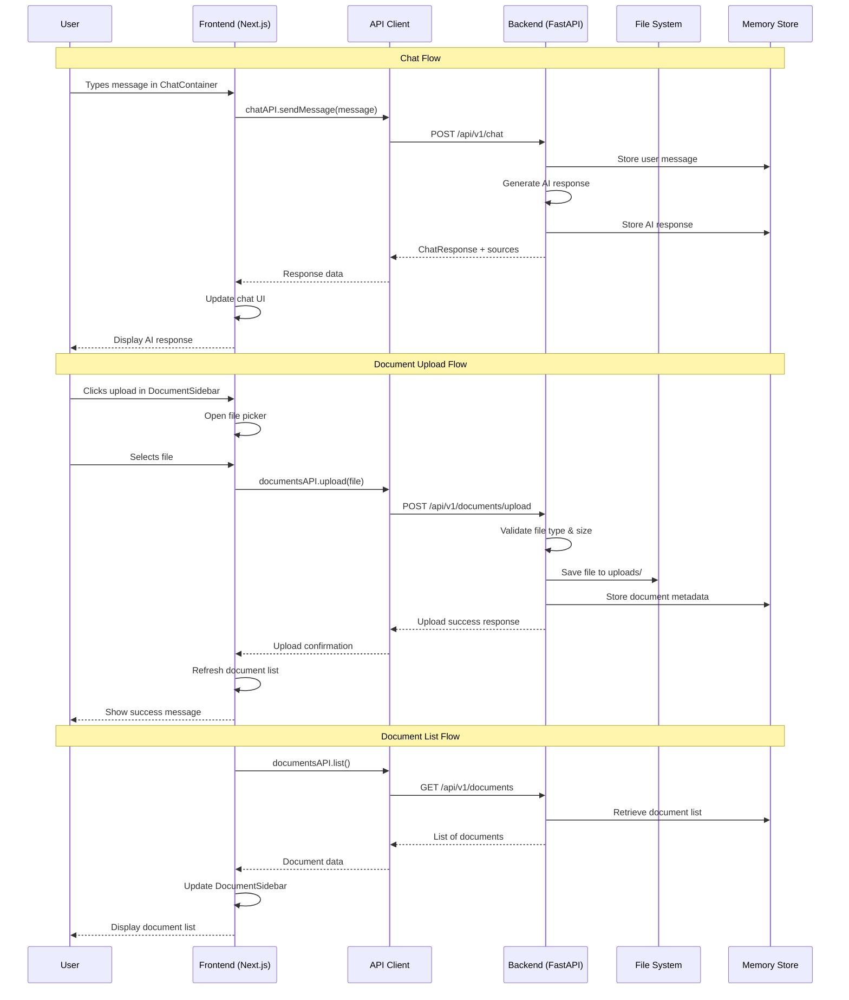
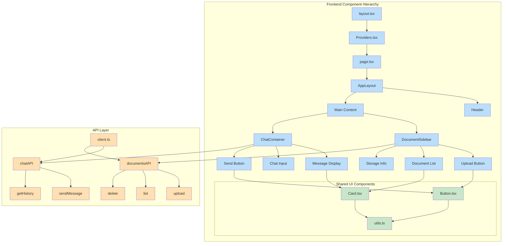
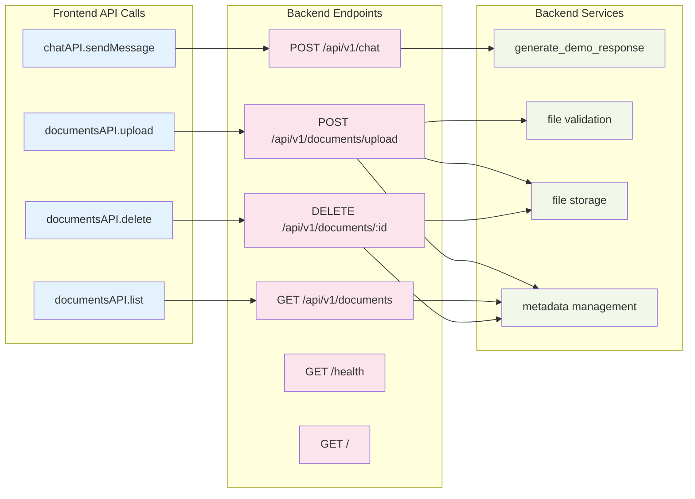
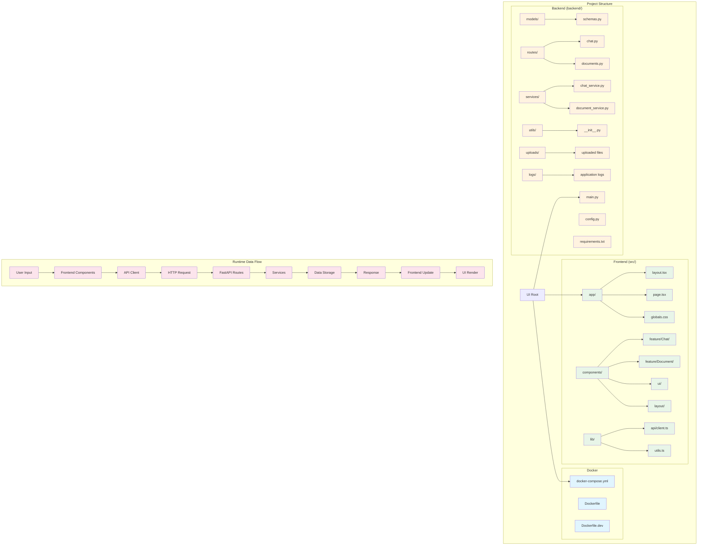
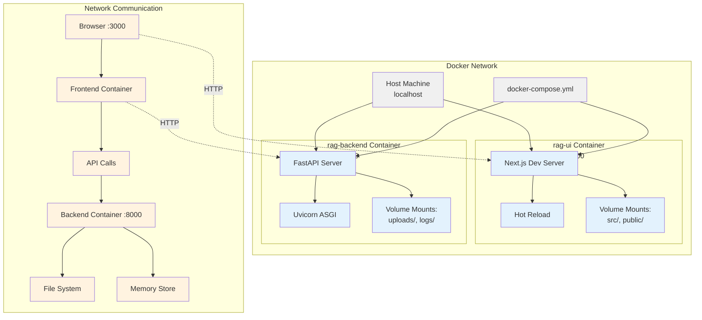

Dựa trên cấu trúc project của bạn, tôi sẽ tạo các diagram Mermaid để minh họa kiến trúc và luồng dữ liệu:

## **1. Architecture Overview**

## **2. Data Flow Diagram**

## **3. Component Architecture**

## **4. API Endpoints Mapping**

## **5. File System & Data Flow**

## **6. Docker Container Communication**

## **Key Points về Architecture:**

### **Frontend (Next.js)**
- **Port**: 3000
- **Tech Stack**: React 18, TypeScript, Tailwind CSS
- **Structure**: App Router, Component-based, API client layer
- **Features**: Chat UI, Document upload, Responsive design

### **Backend (FastAPI)**  
- **Port**: 8000
- **Tech Stack**: Python 3.11, FastAPI, Pydantic
- **Structure**: Routes, Services, Models, File storage
- **Features**: RESTful APIs, File upload, CORS, Auto docs

### **Communication**
- **Protocol**: HTTP/REST
- **Data Format**: JSON
- **File Upload**: multipart/form-data
- **CORS**: Enabled for localhost:3000

### **Docker Setup**
- **Containers**: 2 (UI + Backend)
- **Networking**: Bridge network
- **Volumes**: Source code, uploads, logs
- **Development**: Hot reload enabled

Kiến trúc này đảm bảo tách biệt concerns, dễ scale, và maintainable!